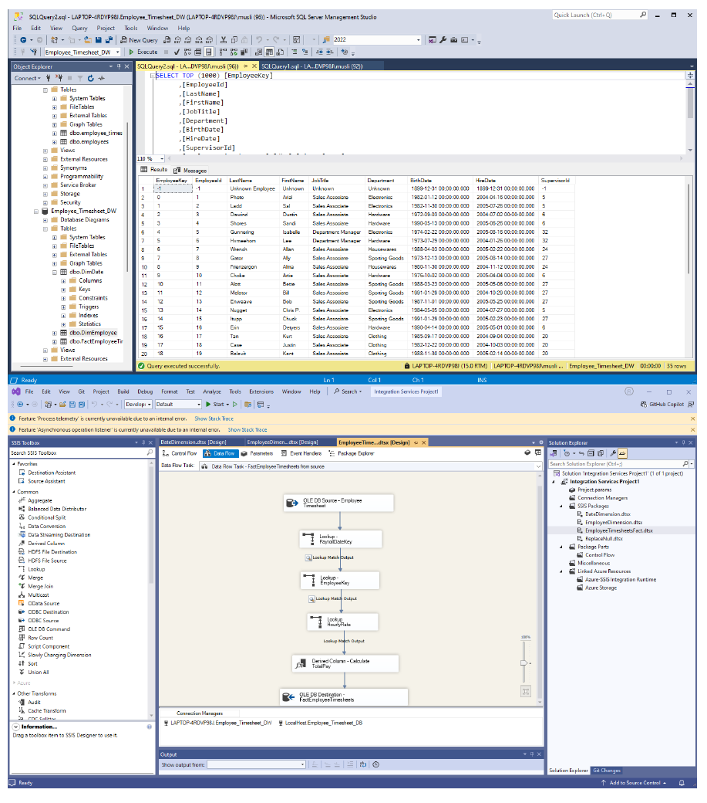
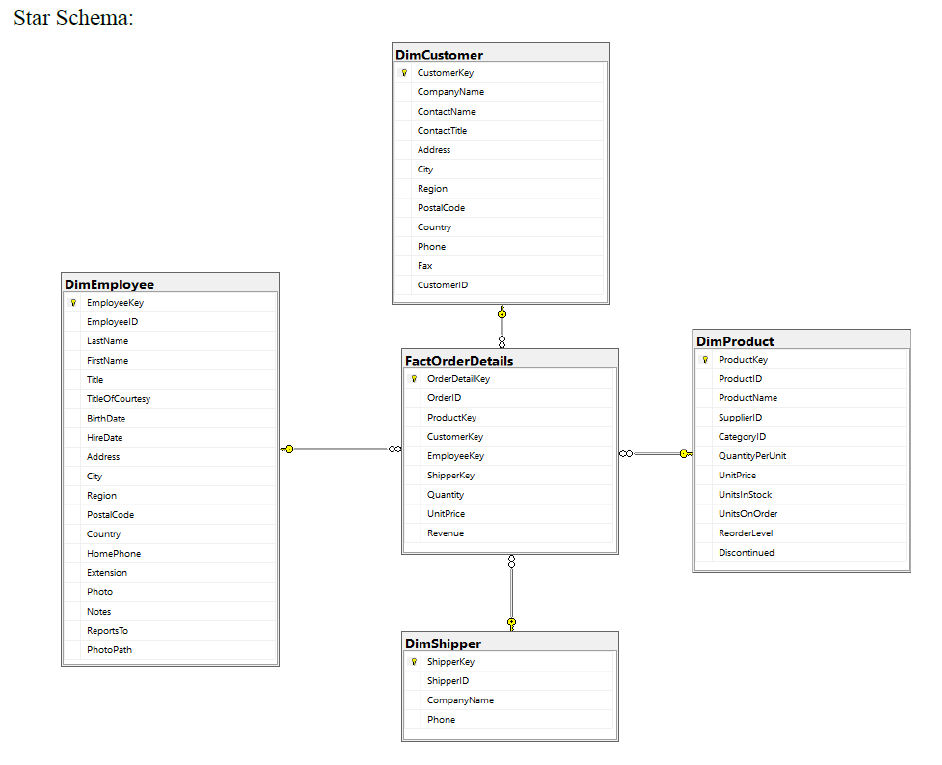
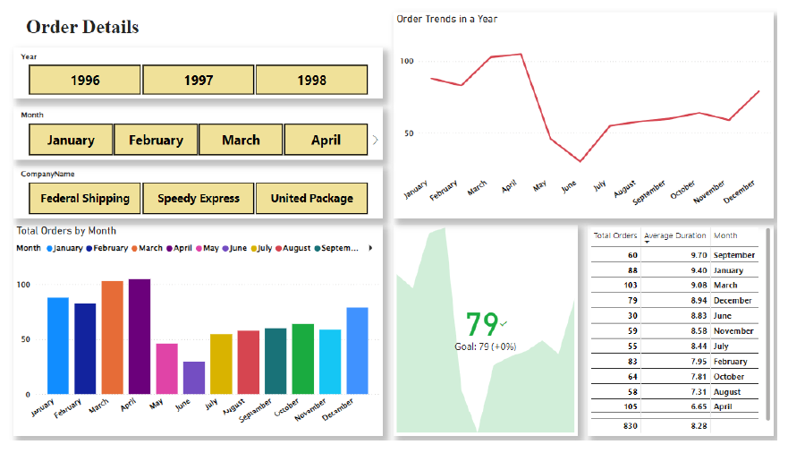
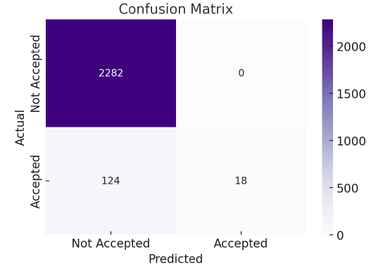
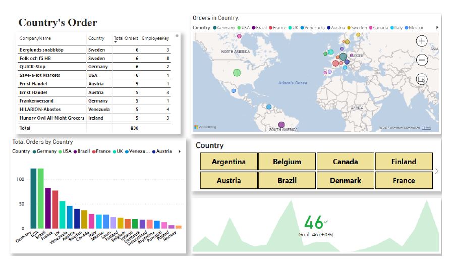

# Hi there, I'm Muhammad Muslihuddin 👋 
### Bachelor of IT (Business Intelligence & Information Systems) | IIUM

I am a Technical BI Analyst and Developer. I specialize in building the **Information Systems** that capture data and architecting the **Data Warehouses** that turn raw noise into strategic business insights.

---

## 🛠️ Technical Skill Matrix

| **Business Intelligence** | **Software Engineering** | **Data Science & Analytics** |
| :--- | :--- | :--- |
| **Tools:** Tableau, Power BI, SSMS | **Web:** Laravel (MVC), Bootstrap | **Languages:** Python (Pandas, Sklearn) |
| **Architecture:** Star Schema, ETL (SSIS) | **Mobile:** Flutter (Dart) | **Mining:** Regression, Classification |
| **Database:** MySQL, SQL Server | **Web3:** Blockchain, Hardhat, Solidity | **Quality:** Data Cleaning & Wrangling |

---

## 📊 Business Intelligence & Data Warehousing
### Case Study: Northwind Sales Analysis
In this project, I transformed a normalized relational database into a high-performance **Sales Data Mart** using the Kimball methodology.

| **1. Data Modeling (SSMS)** | **2. Schema Architecture** | **3. Insight Delivery (Power BI)** |
|:---:|:---:|:---:|
|  |  |  |
| **Database Management:** Managing complex queries and relational integrity within SQL Server. | **Star Schema:** Designed Fact and Dimension tables to optimize query performance for Sales KPIs. | **Executive Reporting:** Interactive dashboard tracking regional growth and shipping performance. |

---

## 🔍 Data Mining & Quality Engineering
**"80% of data science is data cleaning."** I focus heavily on ensuring data integrity before performing predictive analysis.

| **Data Quality & Wrangling** | **Advanced Analytics** |
|:---:|:---:|
|  |  |
| **Python / SSIS:** Handling null values, outlier detection, and data normalization to ensure 99% accuracy. | **Deep Dive:** Utilizing Power BI for trend forecasting and customer segmentation analysis. |

---

## 🎨 Professional Visualization Gallery (Tableau)
I transform complex datasets into visual stories that drive executive decision-making.

  

---

## 💻 App Development & Emerging Tech
I develop the "Data Sources"—the mobile and web applications that feed the BI pipeline.

| **DishDash (Web)** | **Receipt App (Mobile)** | **Blockchain (Web3)** |
| :---: | :---: | :---: |
|  |  |  |
| **Laravel & MySQL** | **Flutter & OCR** | **Hardhat & Solidity** |
| A student-centric recipe portal built with MVC architecture. | A BI tool for personal expense tracking and data visualization. | Smart contract development and automated testing. |

---

## 📫 Let's Connect
- **LinkedIn:** [linkedin.com/in/yourprofile](https://linkedin.com/in/yourprofile)
- **Specialization:** Information Systems Audit, Business Intelligence, and Data Engineering.

---

  

