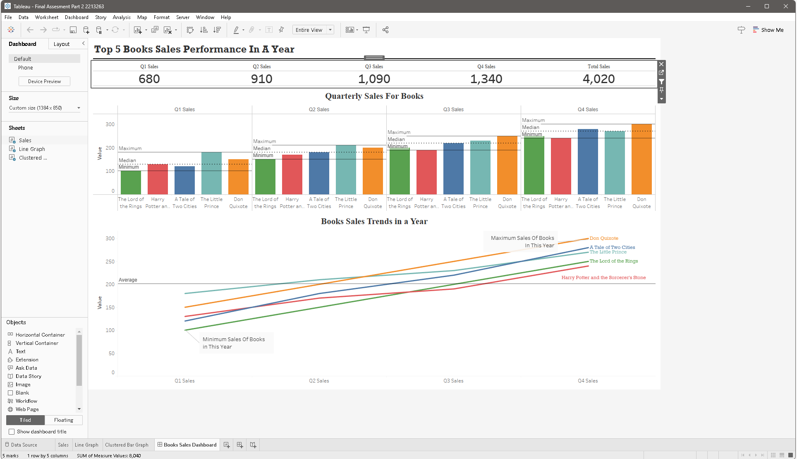

# Hi there, I'm Muhammad Muslihuddin 👋 
### Bachelor of IT (Business Intelligence & Information Systems)

I am an Information Systems specialist focused on the end-to-end data lifecycle. I build the systems that capture data (**Laravel/Flutter/Blockchain**), architect the environments that store it (**SSMS/Data Warehousing**), and develop the analytics that drive business value (**Python/Tableau/Power BI**).

---

## 🛠️ Technical Skill Matrix

| **Business Intelligence** | **Software Engineering** | **Data Science & Analytics** |
| :--- | :--- | :--- |
| **Tools:** Tableau, Power BI, SSMS | **Web:** Laravel (MVC), Bootstrap | **Languages:** Python (Pandas, Sklearn) |
| **Data Warehousing:** ETL (SSIS), Star Schema | **Mobile:** Flutter (Dart) | **Mining:** Regression, Classification |
| **SQL:** DDL/DML, Complex Joins | **Web3:** Blockchain, Hardhat, Solidity | **Quality:** Data Cleaning & Wrangling |

---

## 📊 Business Intelligence & Data Warehousing

### 🏗️ Northwind Sales Analysis System
**Tools:** SQL Server (SSMS), SSIS, Power BI  
Following the Kimball Dimensional Modeling technique, I transformed the relational Northwind database into a high-performance Data Mart.

| **Data Modeling (Star Schema)** | **ETL Pipeline (SSIS)** | **BI Dashboard (Power BI)** |
|:---:|:---:|:---:|
|  |  |  |
| **Architecting Data:** Created a Star Schema featuring `FactOrderDetails` and dimensions for Customers, Employees, Shippers, and Date. | **Cleaning & Loading:** Implemented SSIS packages with Lookup transformations and Derived Columns to handle NULL values. | **Strategic Insight:** Developed a dashboard tracking Regional Sales, Shipping Efficiency, and Product Category performance. |

---

## 🔍 Data Mining & Predictive Analytics
**Tools:** Python (Jupyter), Matplotlib, Scikit-learn  
Applying the **CRISP-DM** methodology to uncover hidden patterns and predict business outcomes.

| **Predictive Modeling** | **Data Quality & Distribution** |
|:---:|:---:|
|  |  |
| **Height/Weight Regression:** Developed a Linear Regression model to predict biometric trends with calculated MSE and MAE metrics. | **Classification Analysis:** Performed exploratory data analysis (EDA) on Credit Card Marketing data to predict offer acceptance. |

---

## 🎨 Professional Visualization (Tableau)
I specialize in creating executive-level dashboards that simplify complex datasets into actionable stories.

  

---

## 💻 Information Systems & Blockchain
I develop the digital infrastructure used to collect and manage business-critical information.

| **DishDash Web App** | **Receipt Management** | **Blockchain Lab** |
| :---: | :---: | :---: |
|  |  |  |
| **Laravel & MySQL** | **Flutter & OCR** | **Hardhat & Solidity** |
| A student-centric recipe portal built with MVC architecture. | A BI tool for personal expense tracking and data visualization. | Smart contract development and automated testing with Hardhat. |

---

## 📫 Connect with me
- **LinkedIn:** [linkedin.com/in/yourprofile](https://linkedin.com/in/yourprofile)
- **Academic Focus:** Data Warehousing, Data Mining, and BI Information Systems.

---

  

